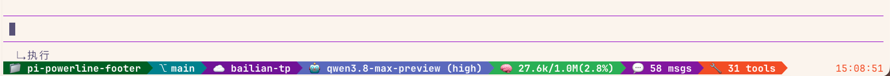

# pi-powerline-footer

Powerline-style status bar footer for [pi coding agent](https://github.com/earendil-works/pi-coding-agent).



```
 📁 my-project  ⎇ main  ☁️ anthropic  🤖 claude-sonnet (medium)  🧠 45.2k/200k(22.6%)  💬 12 msgs  🔧 8 tools   14:32:05
```

## Features

Displays a Powerline-style footer bar with:

- 📁 Current working directory
- ⎇ Git branch
- ☁️ Provider name
- 🤖 Model name + thinking level
- 🧠 Context usage (color-coded: green < 50%, yellow 50-70%, orange 70-90%, red > 90%)
- 💬 Message count
- 🔧 Tool call count
- 🕐 Live clock (24h, right-aligned)
- ↳ Last user request shown below the editor (truncated to 200 chars)

### Last Request Widget

Displays your last message below the input box so you can always see what you asked — even after long agent responses scroll it off screen.

```
 ↳ 执行
```

- Triggers on `session_start`, `agent_end`, and `tool_result` events
- Truncated to 200 characters with ellipsis
- Automatically cleared on session shutdown

## Install

```bash
pi install git:github.com/fan56/pi-powerline-footer
```

Or manually copy/symlink into your pi extensions directory:

```bash
cp -r pi-powerline-footer ~/.pi/agent/extensions/
# or
ln -s /path/to/pi-powerline-footer ~/.pi/agent/extensions/pi-powerline-footer
```

Restart pi to load the extension.

## Configuration

No configuration needed. The footer and last-request widget activate automatically in TUI mode.

## License

[MIT](LICENSE)
